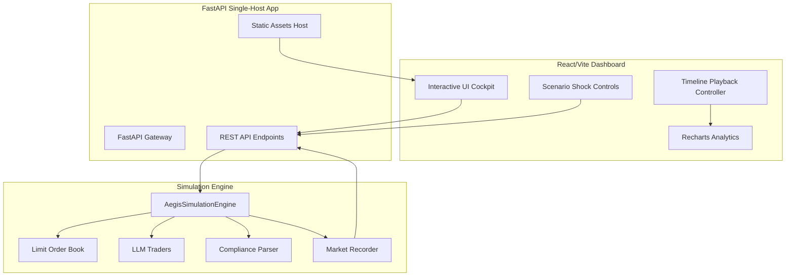

# 🛡️ AegisMarket: Autonomous Financial Agent Stress-Testing & Simulation Platform

AegisMarket is an enterprise-grade, full-stack multi-agent financial simulation framework. It models a synthetic capital market populated by autonomous, LLM-powered traders with diverse risk profiles and behavioral personas. It allows quantitative developers, financial institutions, and policy researchers to stress-test market liquidity, evaluate regulatory shifts, and simulate macroeconomic shocks in a sandbox environment.

By replacing primitive heuristics with a professional **Continuous Double Auction (CDA) Limit Order Book** matching engine and providing a **gorgeous dark-mode dashboard with real-time playback control**, AegisMarket bridges the gap between academic research and commercial software.

---

## 🚀 Interactive UI Dashboard Demo

The React dashboard is engineered for seamless visual review, utilizing a timeline playback mechanic:
- **Configure & Launch**: Dynamically provision agent counts, trading windows, and LLM backends (Gemini vs OpenAI).
- **Interactive Time-Machine Playback**: Press play or use the slider to watch stock prices, session volumes, and agent capital balances animate session-by-session.
- **Forum Intelligence Stream**: Watch the autonomous traders broadcast their beliefs, sentiments, and portfolio rationales to a public thread daily.
- **Scenario Stress Injector**: Inject dynamic macroeconomic disruptions (e.g., policy rate cuts, central bank audits, credit crunches) and immediately witness the emergent behaviors of the agent collective.

---

## 🏗️ Architecture Design



---

## 🛠️ Key Technical Features

### 1. Continuous Double Auction (CDA) Order Book
AegisMarket implements a realistic financial matching engine. Buy limit orders (bids) are sorted descending by price (highest bid first), and sell limit orders (asks) are sorted ascending by price (lowest ask first). Transactions execute immediately when the highest bid price is greater than or equal to the lowest ask price (`bid_price >= ask_price`) at the maker's price.

### 2. Autonomous Leverage & Balance Sheets
Traders maintain dynamic capital sheets tracking stock assets, liquid cash reserves, and multi-day debt liabilities. Before each trading session, agents evaluate their leverage ratio and query the Credit Facility to borrow additional cash. Failure to settle outstanding debt at maturity triggers a **liquidation sequence**, selling assets to cover debt margins.

### 3. Persona-Driven LLM & Mock Fallback Protocols
Traders are assigned distinct behavioral personas affecting their risk thresholds and analytical views:
* **Conservative**: Retains large cash reserves, favors stable industrial stock A, avoids credit debt.
* **Aggressive**: Leverages maximum debt limits, hunts hyper-growth tech stock B, chases market momentum.
* **Balanced**: Automatically targets 50/50 balance sheets, borrows credit selectively.
* **Growth-Oriented**: Targets tech expansion plays with moderate leverage margins.

*Note: If LLM API keys are not detected or external APIs rate-limit, AegisMarket seamlessly falls back to rule-based mathematical actors, preventing application crashes and enabling instant local sandboxing.*

---

## ⚡ Quick Start

### Prerequisites
- Python 3.9+
- Node.js 18+ (for building frontend assets)

### Step 1: Clone and Setup Workspace
```bash
git clone <your-repo-url> AegisMarket
cd AegisMarket
```

### Step 2: Configure Environment Keys
Add your API keys to your shell profile or write them in a local `.env` file:
```bash
# For Gemini LLM Execution
export GOOGLE_API_KEY=your_gemini_key_here

# For OpenAI LLM Execution
export OPENAI_API_KEY=your_openai_key_here
```

### Step 3: Install & Start Python Backend
```bash
# Create and activate virtual environment
python -m venv venv
source venv/bin/activate  # On Windows use: venv\Scripts\activate

# Install requirements
pip install -r backend/requirements.txt

# Start FastAPI Dev Server
uvicorn backend.app.main:app --reload --port 8000
```
*The API endpoints will be hosted at `http://localhost:8000`. You can inspect raw swagger definitions at `http://localhost:8000/docs`.*

### Step 4: Build & Preview Web Dashboard
In another terminal session:
```bash
cd frontend
npm install
npm run build
```
Vite will compile the React dashboard and output static files into the `static/` workspace folder. 
FastAPI mounts this folder automatically, allowing you to view the full application at **`http://localhost:8000`** with zero extra proxy setups!

---

## 🐳 Containerization & Deployment

AegisMarket is optimized for containerized Hosting on cloud spaces like Hugging Face:
```dockerfile
# See Dockerfile for absolute production settings
FROM python:3.9-slim

# Prepare environment
WORKDIR /app
COPY backend/requirements.txt .
RUN pip install --no-cache-dir -r requirements.txt

# Copy built frontend assets and app files
COPY static ./static
COPY backend/app ./app

# Expose spaces default port and execute
EXPOSE 7860
CMD ["uvicorn", "app.main:app", "--host", "0.0.0.0", "--port", "7860"]
```

---

## 📈 Future Roadmaps
- **Multi-Asset Extensions**: Add corporate bonds, interest rate options, and cryptocurrency liquidity pairs.
- **Enhanced Gini Index Profiling**: Real-time Gini coefficients and wealth inequality distribution indices.
- **Reinforcement Learning Benchmarks**: Deploy RL trading agents against LLM personas to assess trading alpha.
